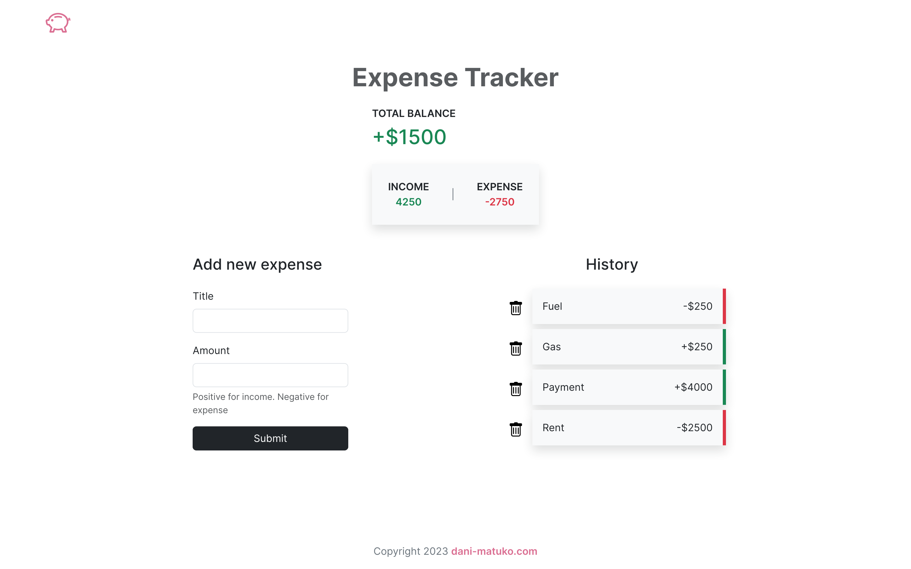

# Expense-Tracker
This is a PHP expense-tracker application powered by MySQL database written in the procedural style.   
The app provides the basic functions you'd expect from an expense-tracker.

 

 

## 🚀 Features
- Add transaction
- Remove transaction
- View total expenses
- View total income
- View total balance
- Other features yet to be implemented

 

## 🔧 Built With

- HTML
- CSS
- PHP
- Bootstrap 5
- SQL
- MySQL

 

## 📦 Setup
Clone this repo to to a new folder named 'expense-tracker'. Move expense-tracker folder to your 'htdocs' folder.

- Notice you must have XAMMP installed on your machine https://www.apachefriends.org/download.html.

 

## 🌏 Usage
* Open xammp and start MySQL Database and Apache server.
* Open you web browser and go to http://localhost/expense-tracker
* You can view the database and table at http://localhost/phpmyadmin/index.php

 

## 📜 License
>You can check out the full license [here](https://github.com/IgorAntun/node-chat/blob/master/LICENSE)

This project is licensed under the terms of the **MIT** license.

 

## 🤝 Support

Contributions, issues, and feature requests are welcome!

Give a ⭐️ if you like this project!
